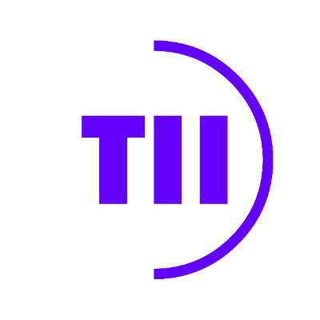
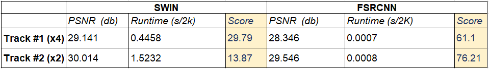

# ICIP 2024: 360° Video Super-Resolution and Quality Enhancement Challenge

<!--  -->

<div align="center">
  
  <span style="font-size: 32px; margin: 0 10px;">×</span>
  
</div>

360° Video Super-Resolution and Quality Enhancement Challenge is held as a part of the **[ICIP2024 conference](https://2024.ieeeicip.org/)** sponsored by **[TII](https://www.tii.ae/)**.

<div align="center">

📕[__Datasets__](https://tiiuae-my.sharepoint.com/:f:/g/personal/ahmed_telili_tii_ae/EogDz0BrzYNLqyj5LpniiOQB6yq-jtpxJFLbTjudB4rGkQ)  __|__ 📝[Evaluation Script](script/quality_assessment.py) __|__ 🧑‍🤝‍🧑[WhatsApp group](https://chat.whatsapp.com/GPy6gBmVbNcC7epkp0t2lW) __|__ [Official website](http://icip24-video360sr.ae)

⏬[Submission example](https://tiiuae-my.sharepoint.com/personal/ahmed_telili_tii_ae/_layouts/15/onedrive.aspx?ga=1&id=%2Fpersonal%2Fahmed%5Ftelili%5Ftii%5Fae%2FDocuments%2F360VistaSR%2Fsubmission%5Ftest%2Ezip&parent=%2Fpersonal%2Fahmed%5Ftelili%5Ftii%5Fae%2FDocuments%2F360VistaSR)

</div>

---

👉 [Track 1：360° Omnidirectional Video Super-Resolution and Quality Enhancement (X4)](#track-0000-omnidirectional-video-super-resolution-x4) **|** [Codalab server](https://codalab.lisn.upsaclay.fr/competitions/17458)

👉 [Track 2：360° Omnidirectional Video Super-Resolution and Quality Enhancement (X2)](#track-0000-omnidirectional-video-super-resolution-x2) **|** [Codalab server](https://codalab.lisn.upsaclay.fr/competitions/17459)

## 🚩 News and Updates

- ✅ 2024.02.05 Release of train data (input and output images) and validation data (inputs only)
- ✅ 2024.02.05 Validation server online
- ✅ 2024.04.15 Final test data release (inputs only)
- ✅ 2024.04.28 Docker file / code submission deadline
- ✅ 2024.05.05 Final test results release to the participants and winner announcement
- ✅ 2024.05.21 Challenge paper submission deadline
- ✅ 2024.10.27 Workshop days, results and award ceremony ([ICIP 2024](https://2024.ieeeicip.org/), Abu DHabi, UAE)

## Introduction

Omnidirectional visual content, commonly referred to as 360-degree images and videos, has garnered significant interest in both academia and industry, establishing itself as the primary media modality for VR/XR applications. 360-degree videos offer numerous features and advantages, allowing users to view scenes in all directions, providing an immersive quality of experience with up to 3 degrees of freedom (3DoF). When integrated on embedded devices with remote control, 360-degree videos offer additional degrees of freedom, enabling movement within the space (6DoF). However, 360-degree videos come with specific requirements, such as high-resolution content with up to 16K video resolution to ensure a high-quality representation of the scene. Moreover, limited bandwidth in wireless communication, especially under mobility conditions, imposes strict constraints on the available throughput to prevent packet loss and maintain low end-to-end latency. Adaptive resolution and efficient compression of 360-degree video content can address these challenges by adapting to the available throughput while maintaining high video quality at the decoder. Nevertheless, the downscaling and coding of the original content before transmission introduces visible distortions and loss of information details that cannot be recovered at the decoder side. In this context, machine learning techniques have demonstrated outstanding performance in alleviating coding artifacts and recovering lost details, particularly for 2D video. Compared to 2D video, 360-degree video presents a lower angular resolution issue, requiring augmentation of both the resolution and the quality of the video.

In this challenge, we aim to establish high-quality benchmarks for 360° video SR, and expect to further highlight the challenges and research problems. This challenge presents an opportunity for the scientific research and industrial community to propose solutions for quality enhancement and super-resolution for 360-degree videos.

## Challenge Description

Only the training and validation sets will be released **during the first phase (model construction period)**, and the HR and four LR 360° videos encoded at 4 different target bitrates using HEVC video encoder are available for the two tracks. The participants can design their methods by considering the characteristics of 360° videos. Then these models can be trained on the training set and evaluated on the validation set. Note that the participants can use additional data.

__During the second phase (testing period)__, the testing set containing only LR 360° videos encoded at the same traget bitrate with hevc encoder will be released. The participants can use the testing LR videos with their trained models. The results, in the format mentionned [Here](https://tiiuae-my.sharepoint.com/personal/ahmed_telili_tii_ae/_layouts/15/onedrive.aspx?ga=1&id=%2Fpersonal%2Fahmed%5Ftelili%5Ftii%5Fae%2FDocuments%2F360VistaSR%2Fsubmission%5Ftest%2Ezip&parent=%2Fpersonal%2Fahmed%5Ftelili%5Ftii%5Fae%2FDocuments%2F360VistaSR), should be submitted by the participants and then evaluated by the organizers with the quantitative metrics. The final score is communicated to participant on the submission portal based only on quality result and model complexity.

### Dataset - 360 VISTA-SR ([Download](https://tiiuae-my.sharepoint.com/:f:/g/personal/ahmed_telili_tii_ae/EogDz0BrzYNLqyj5LpniiOQB6yq-jtpxJFLbTjudB4rGkQ))

We provide a dataset containing 200 360-degree videos, predominantly sourced from YouTube and ODV360 (Link) characterized by high quality and resolution (4K and 2K) in ERP format. All videos are licensed under Creative Commons Attribution (reuse allowed), and our dataset is exclusively designed for academic and research purposes. The video dataset encompasses various content characteristics, including outdoor and indoor scenes, as well as high motion sport contents. Each video consists of 100 frames. The dataset is partitioned into 170 videos for training, 15 for validation, and 15 for testing. Note that additional external content can be incorporated for training.

|         | Training                      | Validation               | Testing                    |
| ------- | ---------------------         | ------------------------ | -------------------------- |
| Source  | Youtube+ODV360                | Youtube+ODV360           | Youtube+ODV360             |
| Number  | 100                           | 20                       | 20                         |
| Storage | 76.7G (HR) + 103.68G (LR)     | 10.6G (HR) + 14.3G (LR)  | 11.5G (HR) + 14.7G (LR)    |

**Note that we do not provide degradation scripts during this challenge to avoid potential testing data leakage.**

### Metrics

We evaluate the super-resolved 360° videos by comparing them to the ground truth HR ERP videos. To measure the fidelity, we adopt the widely used Weighted-to-Spherically-uniform Peak Signal to Noise Ratio (WS-PSNR) as the quantitative evaluation metric. Moreover, we incorporate runtime complexity into our final scoring formula. Therefore, models that optimally balance between quality and processing efficiency are highlight more. For more details, please refer to the detailed descriptions available on the official website [here](http://icip24-video360sr.ae).

## Tracks

#### Track 1：360° Omnidirectional Video Super-Resolution and Qaulity Enhancement (X4)

This track aims To significantly enhance the resolution and overall quality of 360° omnidirectional videos, targeting a 4x improvement in clarity and detail. Participants are required to develop algorithms or systems that can effectively upscale 360° omnidirectional videos by a factor of four (X4), while also improving their overall visual quality. The challenge involves addressing common issues such as blurring, distortions, and artifacts typical in panoramic content. In addition to this, run time complexity is also considered for the final score.

#### Track 2：360° Omnidirectional Video Super-Resolution and Qaulity Enhancement (X2)

This track is dedicated to achieving a remarkable enhancement in both resolution and overall quality of 360° omnidirectional videos, aiming for a substantial 2x improvement in clarity and detail. Participants are challenged to innovate and develop sophisticated algorithms or systems capable of effectively upscaling 360° omnidirectional videos by a factor of two (X2). The goal is not only to magnify the resolution but also to significantly enhance the visual quality, addressing prevalent issues such as blurring, distortions, and artifacts commonly associated with panoramic content. Moreover, unlike the first track, this challenge puts a strong emphasis on the efficiency of the proposed solutions. Runtime complexity will be a crucial factor in the evaluation process, ensuring that the enhancements are not just effective, but also practical. Models demonstrating slower performance will be penalized, incentivizing participants to strike an optimal balance between quality improvement and computational efficiency.

### Baseline example results

<div align="center">
  
</div>

The table presents the scoring outcomes of baseline models on the 360VISTA dataset. For both x2 and x4 tracks, FSRCNN leads according to our scoring criteria. Despite SWIN's superior quality, FSRCNN's faster run time gives it the edge. Thus, the top model is the one that balances quality and complexity effectively. 

## Submission

We use CodaLab for online submission in the development phase. Here, we provide an example [link](https://tiiuae-my.sharepoint.com/personal/ahmed_telili_tii_ae/_layouts/15/onedrive.aspx?ga=1&id=%2Fpersonal%2Fahmed%5Ftelili%5Ftii%5Fae%2FDocuments%2F360VistaSR%2Fsubmission%5Ftest%2Ezip&parent=%2Fpersonal%2Fahmed%5Ftelili%5Ftii%5Fae%2FDocuments%2F360VistaSR) to help participants to format their submissions. In the test phase, the final results and the source codes (both training and test) need to be submitted. Please refer to our [online website](www.icip24-video360sr.ae) for details of the submission rules.

## Training and Validation

### Requirement

Use pip to install all requirements:

```bash 
pip install -r requirements.txt

```

### Configuration

Before training and testing, please make sure the fields in [config.yaml](src/config.yaml) is properly set.

```yaml 
log_dir: "output/FSRCNN"  # Directory for logs and outputs

dataset:
  train:
    hr_root: "data/train/HR"
    lr_root: "data/train/LR_X4"
    lr_compression_levels: ["1", "2", "3", "4"]  # list for Compression levels directories
    crop_size: 64 # The height and width of cropped patch for training.
    transform: True # if True data augmentation is used
    batch_size: 4 
    shuffle: True
    num_workers: 8 # number of cores used for data loader
  val:
    hr_root: "data/val/HR" 
    lr_root: "data/val/LR_X4"
    lr_compression_levels: ["1", "2", "3", "4"]
    batch_size: 4
    shuffle: False
    num_workers: 1
  test:
    hr_root: ''
    lr_root: "data/test/LR_X4"
    lr_compression_levels: ["1"]
    batch_size: 2
    shuffle: False    
    num_workers: 1                       

model:
  path: "src/model/FSRCNN.py"   # Path to the model definition file
  name: "FSRCNN" # Model class name to be instantiated
  scale_factor: 4 # adjust the scale factor

learner:
  general:
    total_steps: 3000000 # The number of training steps.
    log_train_info_steps: 100 # The frequency of logging training info.
    keep_ckpt_steps: 20000 # The frequency of saving checkpoint.
    valid_steps: 5000 # The frequency of validation.
    
  optimizer: # Define the module name and setting of optimizer
    name: "Adam"              
    lr: 0.0001                 
    beta_1: 0.9
    beta_2: 0.999
    
  lr_scheduler: # Define the module name and setting of learning rate scheduler
    name: "ExponentialDecay"
    initial_learning_rate: 0.0001
    decay_steps: 10000
    decay_rate: 0.1
    staircase: True
    
  saver: # The path to checkpoint where would be restored from.
    restore: #checkpoints/step_308000_checkpoint_x4.pth.tar
  loss:
    name: "CharbonnierLoss"   # Type of loss function to use
    params: {}                # Additional parameters for the loss function, if needed

```

### Train

To train the model, use the following command:

```bash 
python main.py --process train --config_path config.yml

```

### Test

To generate testing outputs, use the following command:

```bash 
python main.py --process test --config_path config.yml

```

## FAQ

1.  We do not restrict competitors from using additional training data. If it is used, it is necessary to indicate the source and amount.

2.  We do not restrict competitors from using pretrained networks. If it is used, it is necessary to provide details.

3.  We do not restrict the model size and running time. Please provide them in the final submission.

### Organizers

Ahmed Telili
Ibrahim Farhat
Wessim Hamidouche
Hadi Amirpour

#### Acknowledgement

We use the GitHub README.md template from [Stereo SR competition](https://github.com/The-Learning-And-Vision-Atelier-LAVA/Stereo-Image-SR/tree/NTIRE2022)

We inspired the Framework template from [mai22-real-time-video-sr](https://github.com/MediaTek-NeuroPilot/mai22-real-time-video-sr/tree/main)

## 🧑‍🤝‍🧑 WhatsApp group

<div align="center">
  
</div>
