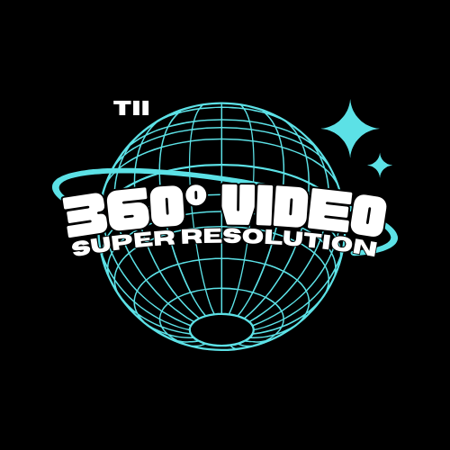

---
runme:
  id: 01HNA3T4Y0XH3J4YDF03YCTW16
  version: v2.2
---

# ICIP 2024: 360° Video Super-Resolution and Quality Enhancement Challenge

<!--  -->

  
  ×
  

360° Video Super-Resolution and Quality Enhancement Challenge is held as a part of the **[ICIP2024 conference](https://2024.ieeeicip.org/)** sponsored by **[TII](https://www.tii.ae/)**.

📕[__Datasets__](https://tiiuae-my.sharepoint.com/:f:/g/personal/ahmed_telili_tii_ae/EogDz0BrzYNLqyj5LpniiOQB6yq-jtpxJFLbTjudB4rGkQ)  __|__ 📝[Evaluation Script](https://github.com/360SR/360SR-Challenge/blob/main/scripts/cal_ws_metrics.py) __|__ 🧑‍🤝‍🧑[Discord group](#discordgroup)

⏬[factsheet template and guidelines for the final submission](https://github.com/360SR/360SR-Challenge/raw/main/CVPR-NTIRE%202023%20360%C2%B0%20Omnidirectional%20Super-Resolution%20Challenge%20Factsheet.zip)

---

👉 [Track 1：360° Omnidirectional Video Super-Resolution and Quality Enhancement (X4)](#track-0000-omnidirectional-video-super-resolution-x4) **|** [Codalab server](https://codalab.lisn.upsaclay.fr/competitions/17327)

👉 [Track 2：360° Omnidirectional Video Super-Resolution and Quality Enhancement (X2)](#track-0000-omnidirectional-video-super-resolution-x2) **|** [Codalab server](https://codalab.lisn.upsaclay.fr/competitions/17327)

## 🚩 News and Updates

- ✅ 2024.01.30 Release of train data (input and output images) and validation data (inputs only)
- ✅ 2024.01.30 Validation server online
- ✅ 2024.03.18 Final test data release (inputs only)
- ✅ 2024.03.22 test result submission deadline
- ✅ 2024.03.22 fact sheet / code / model submission deadline
- ✅ 2024.04.01 Final test results release to the participants and winner announcement
- ✅ 2024.04.21 challenge paper submission deadline
- ✅ 2024.10.27 workshop days, results and award ceremony ([ICIP 2024](https://2024.ieeeicip.org/), Abu DHabi, UAE)

## Introduction

Omnidirectional visual content, commonly referred to as 360-degree images and videos, has garnered significant interest in both academia and industry, establishing itself as the primary media modality for VR/XR applications. 360-degree videos offer numerous features and advantages, allowing users to view scenes in all directions, providing an immersive quality of experience with up to 3 degrees of freedom (3DoF). When integrated on embedded devices with remote control, 360-degree videos offer additional degrees of freedom, enabling movement within the space (6DoF). However, 360-degree videos come with specific requirements, such as high-resolution content with up to 16K video resolution to ensure a high-quality representation of the scene. Moreover, limited bandwidth in wireless communication, especially under mobility conditions, imposes strict constraints on the available throughput to prevent packet loss and maintain low end-to-end latency. Adaptive resolution and efficient compression of 360-degree video content can address these challenges by adapting to the available throughput while maintaining high video quality at the decoder. Nevertheless, the downscaling and coding of the original content before transmission introduces visible distortions and loss of information details that cannot be recovered at the decoder side. In this context, machine learning techniques have demonstrated outstanding performance in alleviating coding artifacts and recovering lost details, particularly for 2D video. Compared to 2D video, 360-degree video presents a lower angular resolution issue, requiring augmentation of both the resolution and the quality of the video.

In this challenge, we aim to establish high-quality benchmarks for 360° video SR, and expect to further highlight the challenges and research problems. This challenge presents an opportunity for the scientific research and industrial community to propose solutions for quality enhancement and super-resolution for 360-degree videos.

## Challenge Description

Only the training and validation sets will be released **during the first phase (model construction period)**, and the HR and four LR 360° videos encoded at 4 different target bitrates using HEVC video encoder are available for the two tracks. The participants can design their methods by considering the characteristics of 360° videos. Then these models can be trained on the training set and evaluated on the validation set. Note that the participants can use additional data.

__During the second phase (testing period)__, the testing set containing only LR 360° videos encoded at the same traget bitrate with hevc encoder will be released. The participants can use the testing LR videos with their trained models. The results, in the format mentionned [here](#github_link), should be submitted by the participants and then evaluated by the organizers with the quantitative metrics. The final score is communicated to participant on the submission portal based only on [PSNR](#psnr) and model complexity, as explained in the formula [here](#final_score).

### ● Dataset - 360 VISTA-SR

We provide a dataset containing 200 360-degree videos, predominantly sourced from YouTube and ODV360 (Link) characterized by high quality and resolution (4K and 2K) in ERP format. All videos are licensed under Creative Commons Attribution (reuse allowed), and our dataset is exclusively designed for academic and research purposes. The video dataset encompasses various content characteristics, including outdoor and indoor scenes, as well as high motion sport contents. Each video consists of 100 frames. The dataset is partitioned into 170 videos for training, 15 for validation, and 15 for testing. Note that additional external content can be incorporated for training.

|         | Training              | Validation            | Testing              |
| ------- | --------------------- | --------------------- | -------------------- |
| Source  | Youtube+ODV360        | Youtube+ODV360        | Youtube+ODV360       |
| Number  | 100                   | 20                    | 20                   |
| Storage | ?G (HR) + ?M (LR)     | ?M (HR) + ?M (LR)     | ?M (HR) + ?M (LR)    |

### ● [Download](https://tiiuae-my.sharepoint.com/:f:/g/personal/ahmed_telili_tii_ae/EogDz0BrzYNLqyj5LpniiOQB6yq-jtpxJFLbTjudB4rGkQ)

### ● Settings

Unlike previous settings that directly apply bicubic downsampling to generate low-resolution (LR) ERP images, we design a more realistic way to generate LR ERP images by considering the real acquisition process of 360° images. Since raw 360° images are captured by fisheye lens and are then saved as fisheye formats, thus performing degradations on fisheye images is more realistic and reasonable.

**Note that we do not provide degradation scripts during this challenge to avoid potential testing data leakage.**

### ● Metrics

We evaluate the super-resolved 360° images by comparing them to the ground truth HR ERP images. To measure the fidelity, we adopt the widely used Weighted-to-Spherically-uniform Peak Signal to Noise Ratio (WS-PSNR) as the quantitative evaluation metric.

## Track 1：360° Omnidirectional Video Super-Resolution and Qaulity Enhancement (X4)

## Track 2：360° Omnidirectional Video Super-Resolution and Qaulity Enhancement (X2)

## Submission

We use CodaLab for online submission in the development phase. Here, we provide an example (TBD) to help participants to format their submissions. In the test phase, the final results and the source codes (both training and test) need to be submitted. Please refer to our [online website](https://github.com/360SR/360SR-Challenge) for details of the submission rules.

## Important Dates

- 2024.01.30 Release of train data (input and output images) and validation data (inputs only)
- 2024.01.30 Validation server online
- 2024.03.18 Final test data release (inputs only)
- 2024.03.22 test result submission deadline
- 2024.03.22 fact sheet / code / model submission deadline
- 2024.04.01 Final test results release to the participants and winner announcement
- 2024.04.21 challenge paper submission deadline
- 2024.10.27 workshop days, results and award ceremony (ICIP 2024, Abu DHabi, UAE)

## Scripts

We provide some useful scripts:

- WS-PSNR evaluation
- sub-image cropping
- dataset loader

## FAQ

1.  We do not restrict competitors from using additional training data. If it is used, it is necessary to indicate the source and amount.

2.  We do not restrict competitors from using pretrained networks. If it is used, it is necessary to provide details.

3.  We do not restrict the model size and running time. Please provide them in the final submission.

### Organizers

Ahmed Telili
Ibrahim Farhat
Wessim Hamidouche
Hadi Amirpour

#### Acknowledgement

We use the GitHub README.md template from [Stereo SR competition](https://github.com/The-Learning-And-Vision-Atelier-LAVA/Stereo-Image-SR/tree/NTIRE2022)

## 🧑‍🤝‍🧑 WhatsApp group
